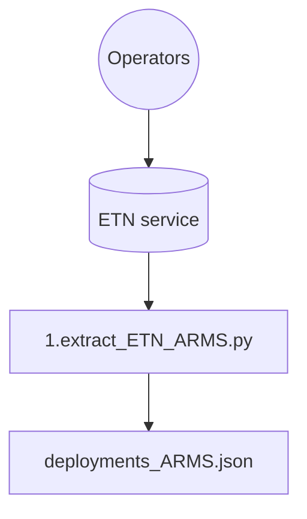
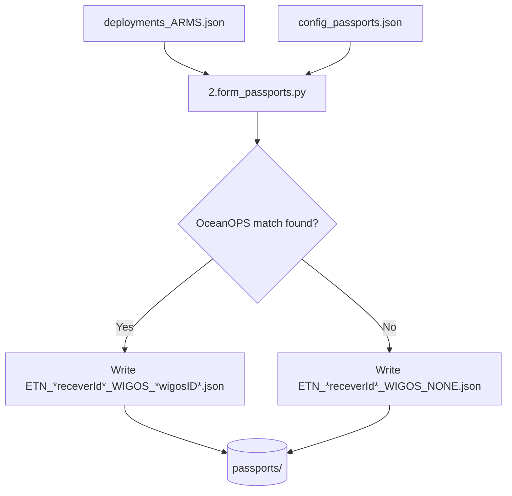
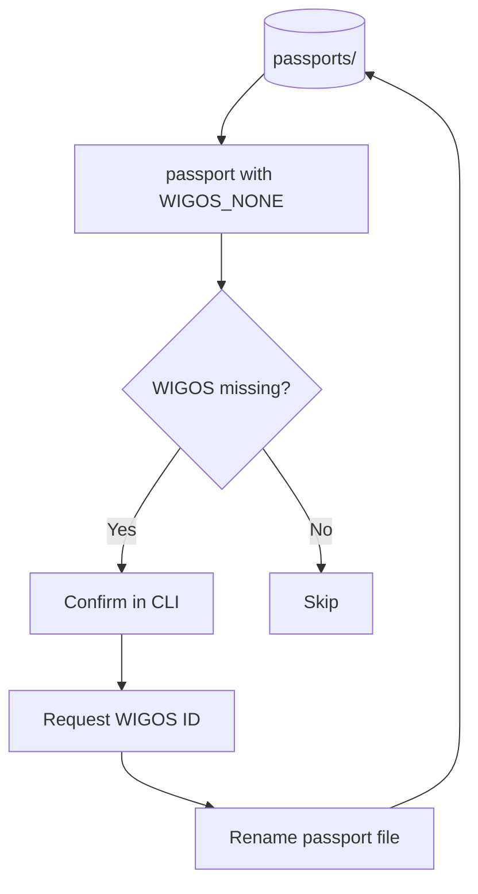
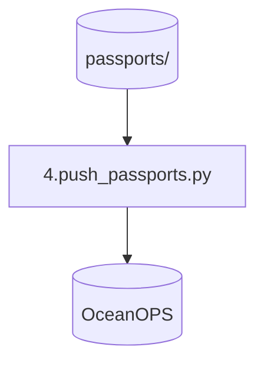

# ARMS ingestion

## Part 1: pull ARMS metadata from ETN

ARMS data is pulled from ETN with `1.extract_ETN_ARMS.py`.
- Credentials come from `.Renviron`.
- The filter parameters live in the ETN request payload.

The output is `etn_arms_export/deployments_ARMS.json` with the variable fields used downstream:
- deployment_id
- receiver_id
- station_name
- deploy_latitude
- deploy_longitude
- deploy_date_time
- recover_date_time

## Part 2: create passports

The deployment export is merged with static config from `scripts/config/config_passports.json` in `2.form_passports.py`.
Before writing a file, the script queries OceanOPS by `receiver_id` and program to see whether a matching platform already exists.

- Match found: update the passport payload and write `ETN_*receverId*_WIGOS_*wigosID*.json`
- No match: write `ETN_*receverId*_WIGOS_NONE.json`

## Part 3: assign WIGOS-ID if missing

`3.assign_missing_wigos.py` scans `passports/` for `WIGOS_NONE` files, asks for confirmation, then requests a real WIGOS ID from OceanOPS and renames the passport.

## Part 4: push passports

`4.push_passports.py` sends each passport from `passports/` to OceanOPS.

