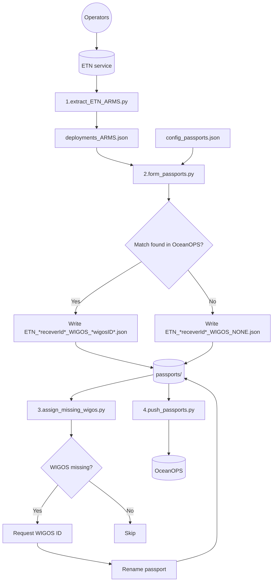

# ARMS sync flow

```mermaid
flowchart TB

A((Operators)) --> B[(ETN service)]
B --> C[1.extract_ETN_ARMS.py]
C --> D[deployments_ARMS.json]

D --> E[2.form_passports.py]
F[config_passports.json] --> E

E --> G{Match found in OceanOPS?}
G -- Yes --> H[Write ETN_*receverId*_WIGOS_*wigosID*.json]
G -- No --> I[Write ETN_*receverId*_WIGOS_NONE.json]

H --> J[(passports/)]
I --> J

J --> K[3.assign_missing_wigos.py]
K --> L{WIGOS missing?}
L -- Yes --> M[Request WIGOS ID]
M --> N[Rename passport]
L -- No --> O[Skip]

N --> J

J --> P[4.push_passports.py]
P --> Q[(OceanOPS)]
```
