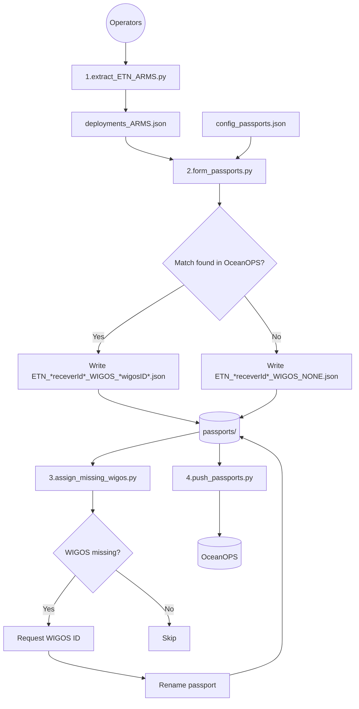

# ARMS sync flow

```mermaid
flowchart TB

A((Operators)) --> B[1.extract_ETN_ARMS.py]
B --> C[deployments_ARMS.json]

C --> D[2.form_passports.py]
E[config_passports.json] --> D

D --> F{Match found in OceanOPS?}
F -- Yes --> G[Write ETN_*receverId*_WIGOS_*wigosID*.json]
F -- No --> H[Write ETN_*receverId*_WIGOS_NONE.json]

G --> I[(passports/)]
H --> I

I --> J[3.assign_missing_wigos.py]
J --> K{WIGOS missing?}
K -- Yes --> L[Request WIGOS ID]
L --> M[Rename passport]
K -- No --> N[Skip]

M --> I

I --> O[4.push_passports.py]
O --> P[(OceanOPS)]
```
